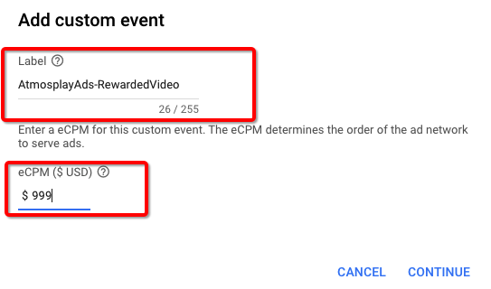

# 概要
本文档描述了如何通过Admob聚合Atmosplay SDK，目前支持的广告形式有Interstitial、Rewarded Video、Banner。  

[See the English integration guide](https://github.com/Atmosplay/AdMobAdapter-AtmosplayAds-iOS/wiki)

# 集成前准备
## 入门指南
在将Atmosplay SDK聚合到Admob之前，请按照以下说明操作：  

1.关于Admob SDK 集成说明，请参考[Admob SDK集成文档](https://developers.google.com/admob/ios/quick-start)  

2.请仔细阅读[Atmosplay 开发者集成文档](https://github.com/Atmosplay/Help-Center-for-Publisher/blob/master/guides.md),其中介绍了如何在Atmosplay创建App ID、AdUnitID。

## 通过CocoaPods集成Admob-Atmosplay-iOS Adapter
要将该SDK导入iOS项目，最简便的方法就是使用[CocoaPods](https://guides.cocoapods.org/using/getting-started)。  

请打开项目的 Podfile 并将下面这行代码添加到应用的目标中：
```ruby
pod 'GoogleMobileAdsMediationAtmosplayAds'
```

然后使用命令行运行：
```sh
$ pod install --repo-update
```

若您使用的是Unity开发环境，将下面代码添加到`GoogleMobileAdsDependencies.xml`文件中
```
<iosPod name="GoogleMobileAdsMediationAtmosplayAds" version="3.0.1">
    </iosPod>
```

如果您刚开始接触 CocoaPods，请参阅其[官方文档](https://guides.cocoapods.org/using/using-cocoapods)，了解如何创建和使用 Podfile。

# Admob后台配置指南
在Admob用户界面，完成如下操作即可设置Custom SDK Network。

## 创建Mediation
选择Mediation,然后点击Create Mediation Group.  

  

## 添加Custom Event
1、进入创建好的Mediation Group，找到最下方Ad sources模块，点击Add Custom Event.


2、填写"Lable",根据自己需要填写，不能修改。

3、测试时，需要将默认的AdMob Network 广告源的优化关闭，并将Atmosplay的eCPM设置为最高。


## 配置Class Name和Parameter

1、Class Name填写Atmosplay Adapter ClassName.  

	- Banner  
```
AtmosplayAdsBannerAdapter
```

	- Interstitial  
```
AtmosplayAdsInterstitialAdapter
```
	
	- Rewarded Video  
```
AtmosplayAdsRewardedVideoAdapter
```
	
	- Rewarded Video Legacy  
```
AtmosplayAdsRewardedVideoAdapterLegacy
```

2、Parameter使用json格式，参数中不能含有空格，注意大小写，具体格式参考下方说明。

```
{"AppID":"YOUR_APP_ID","AdUnitID":"YOUR_ADUNIT_ID"}
```


# 测试ID
| Ad Format     | App_ID                               | Ad_Unit_id                           |
| ------------- | ------------------------------------ | ------------------------------------ |
| RewardedVideo | A650AB0D-7BFC-2A81-3066-D3170947C3DA | BAE5DAAC-04A2-2591-D5B0-38FA846E45E7 |
| Interstitial  | A650AB0D-7BFC-2A81-3066-D3170947C3DA | 0868EBC0-7768-40CA-4226-F9924221C8EB |
| Banner        | A650AB0D-7BFC-2A81-3066-D3170947C3DA | A49521F3-339D-994F-FC80-F9C4170AA0CF |


